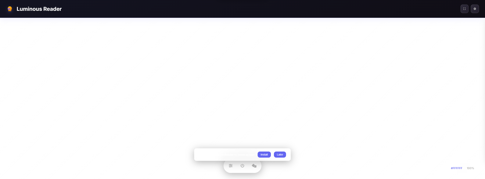
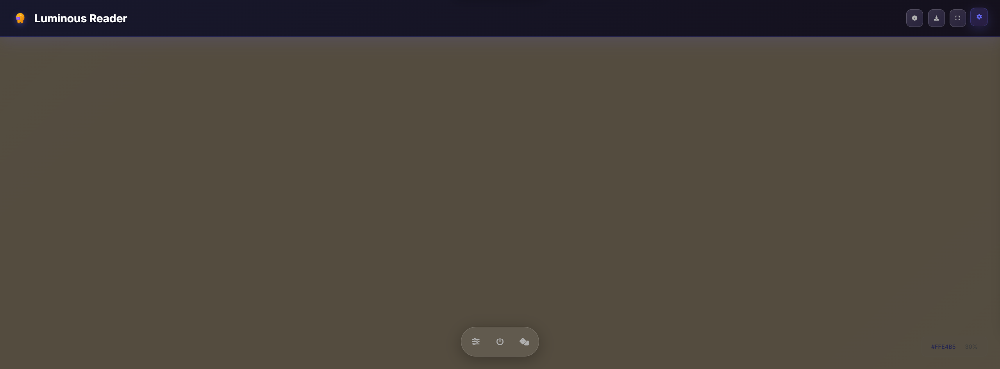
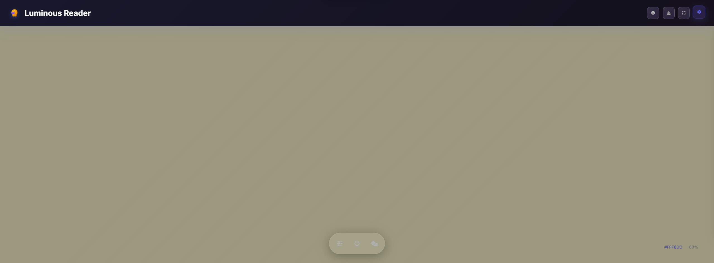
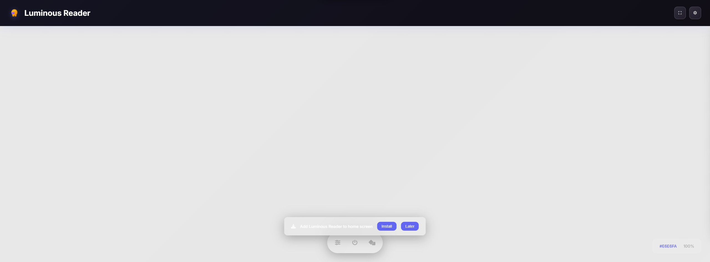
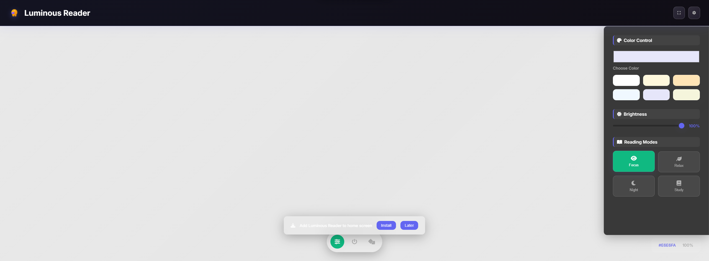
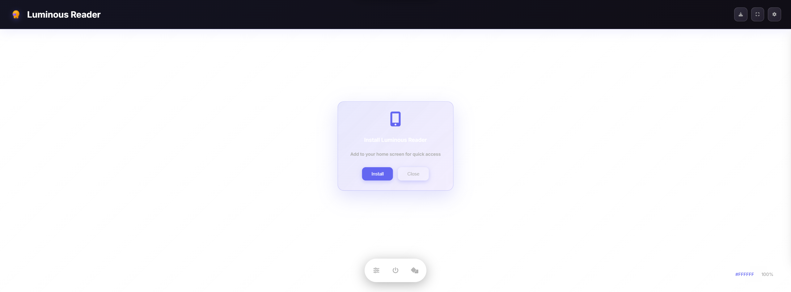

# 🌟 Luminous Reader

<div align="center">


**Transform your monitor into an elite reading lamp**

*Modern, elegant, and eye-friendly reading experience*

[🌐 Live Demo](https://berkay-c.github.io/LuminousReader/) • [📖 Documentation](#-features) • [🚀 Quick Start](#-quick-start)

</div>

---

## 📸 Screenshots

<div align="center">

### Main Interface


### Reading Modes



### Interactive Features




### Settings & PWA



</div>

---

## ✨ Features

### 🎨 **Advanced Color Control**
- **Custom Color Picker** - Choose any color you prefer
- **Smart Preset Palettes** - 6 optimized colors for different reading scenarios
- **Live Preview** - See changes instantly as you adjust

### 💡 **Intelligent Brightness**
- **Smooth Slider Control** - 10-100% brightness with fluid transitions
- **Eye Strain Reduction** - Automatic blue light filtering
- **Perfect for Any Environment** - From bright rooms to complete darkness

### 📚 **Smart Reading Modes**
- **🔍 Focus Mode** - Bright white light for intense reading
- **🍃 Relax Mode** - Soft cream light for comfortable reading
- **🌙 Night Mode** - Warm, dim light to preserve your sleep cycle
- **📖 Study Mode** - Balanced light optimized for learning

### ⚡ **Lightning Fast Controls**
- **One-Touch Access** - Quick controls for instant adjustments
- **Random Color Generator** - Dice button for surprise colors
- **Panel Toggle** - Hide/show controls with one click
- **Keyboard Shortcuts** - Full keyboard navigation support
- **Smart Memory** - Remembers your preferences automatically

### 📱 **Progressive Web App**
- **Install Anywhere** - Works on desktop, tablet, and mobile
- **Offline Ready** - Service worker ensures reliability
- **Native Feel** - Feels like a real app when installed

### 🎨 **Modern Design**
- **Glassmorphism UI** - Beautiful blur effects and transparency
- **Responsive Design** - Perfect on any screen size
- **Smooth Animations** - Delightful micro-interactions

---

## 🚀 Quick Start

### 🌐 **Try It Online**
**[🚀 Live Demo](https://berkay-c.github.io/LuminousReader/)** - Experience the app directly in your browser!

### 💻 **Local Development**

```bash
# Clone the repository
git clone https://github.com/berkay-c/LuminousReader.git
cd LuminousReader

# Install dependencies (optional)
npm install

# Start development server
npm run dev
# or
npx live-server --port=3000
```

### 📱 **Install as PWA**
1. Open the app in your browser
2. Click the **Install** button in the header (📥 icon)
3. Click "Install" in the popup to add to your home screen
4. Enjoy native app experience!

**💡 Tip:** The install prompt is now manually triggered for better user control!

---

## 🎮 How to Use

### 🎯 **Basic Usage**
1. **Choose Your Color** - Use the color picker or select from presets
2. **Adjust Brightness** - Drag the slider to your preferred level
3. **Select Reading Mode** - Pick the mode that suits your activity
4. **Go Fullscreen** - Press `F` for immersive experience
5. **Start Reading** - Your monitor is now your personalized reading lamp!

### ⌨️ **Keyboard Shortcuts**
| Key | Action |
|-----|--------|
| `Space` | Toggle power on/off |
| `F` | Toggle fullscreen mode |
| `P` | Toggle control panel |
| `R` | Random color selection |

### 🎨 **Reading Modes Explained**
- **🔍 Focus Mode**: Bright white light (100% brightness) - Perfect for intense reading, studying, or detailed work
- **🍃 Relax Mode**: Soft cream light (60% brightness) - Ideal for casual reading and relaxation
- **🌙 Night Mode**: Warm amber light (30% brightness) - Reduces blue light for better sleep
- **📖 Study Mode**: Balanced light (80% brightness) - Optimized for learning and note-taking

---

## 🛠️ Technologies

<div align="center">

| Technology | Purpose |
|------------|---------|
| **HTML5** | Modern semantic structure |
| **CSS3** | Glassmorphism, animations, responsive design |
| **JavaScript ES6+** | Modern JavaScript features |
| **PWA** | Service Worker, Manifest |
| **Web APIs** | Local Storage, Fullscreen API |

</div>

---

## 📁 Project Structure

```
LuminousReader/
├── index.html              # Main HTML file
├── README.md              # Project documentation
├── LICENSE                # MIT license
├── package.json           # Project configuration
├── screenshots/           # App screenshots
├── public/
│   └── manifest.json      # PWA manifest
└── src/
    ├── assets/
    │   ├── icons/         # SVG icons
    │   └── images/        # Logo and graphics
    ├── css/
    │   └── main.css       # Main stylesheet
    └── js/
        ├── app.js         # Main application logic
        └── sw.js          # Service worker
```

---

## 🌟 Key Benefits

### 👁️ **Eye Health**
- **Blue Light Reduction** - Warm color options reduce eye strain
- **Adjustable Brightness** - Perfect for any lighting condition
- **Smooth Transitions** - No jarring changes that hurt your eyes

### 🚀 **Performance**
- **Lightning Fast** - Loads instantly, works offline
- **Minimal Resources** - Uses less than 1MB of data
- **Cross-Platform** - Works on any device with a browser

### 🎨 **User Experience**
- **Intuitive Design** - Easy to use for anyone
- **Beautiful Interface** - Modern glassmorphism design
- **Responsive** - Perfect on desktop, tablet, and mobile

---

## 🤝 Contributing

We welcome contributions! Here's how you can help:

1. **🍴 Fork** the repository
2. **🌿 Create** a feature branch (`git checkout -b feature/amazing-feature`)
3. **💾 Commit** your changes (`git commit -m 'Add amazing feature'`)
4. **📤 Push** to the branch (`git push origin feature/amazing-feature`)
5. **🔀 Open** a Pull Request

### 🐛 **Bug Reports**
Found a bug? Please [open an issue](https://github.com/berkay-c/LuminousReader/issues) with:
- Description of the problem
- Steps to reproduce
- Expected vs actual behavior
- Browser and device information

### 💡 **Feature Requests**
Have an idea? We'd love to hear it! [Create an issue](https://github.com/berkay-c/LuminousReader/issues) with:
- Clear description of the feature
- Why it would be useful
- Any mockups or examples

---

## 📄 License

This project is licensed under the **MIT License** - see the [LICENSE](LICENSE) file for details.

---

## 📞 Contact

<div align="center">

**Berkay Çiftçi** - Software & RPA Developer

[](https://github.com/berkay-c)
[](mailto:berkayyasinciftci@gmail.com)

</div>

---

<div align="center">

**Transform your reading experience with Luminous Reader!** 🌟

*Made with ❤️ by [Berkay Çiftçi](https://github.com/berkay-c)*

[⬆ Back to Top](#-luminous-reader)

</div>